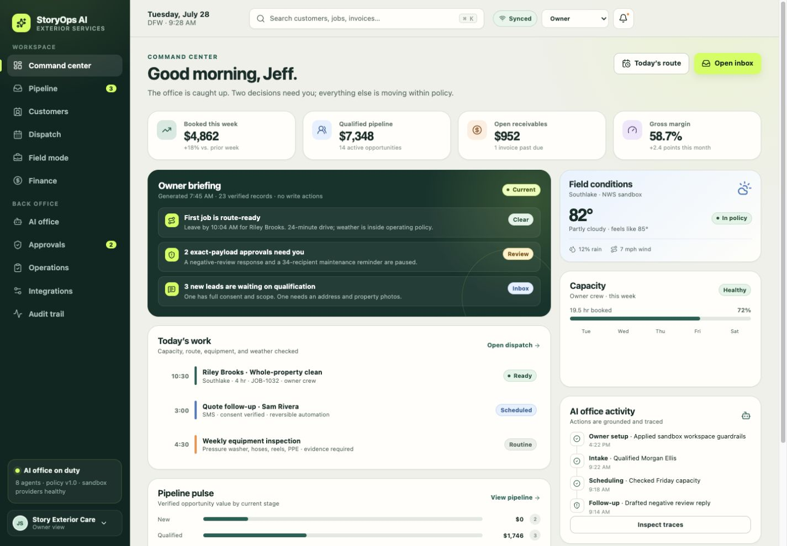
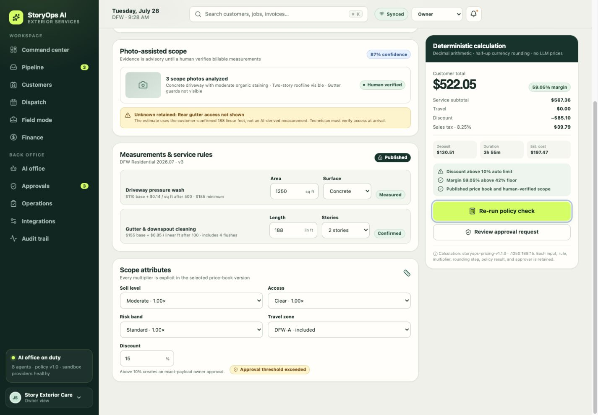
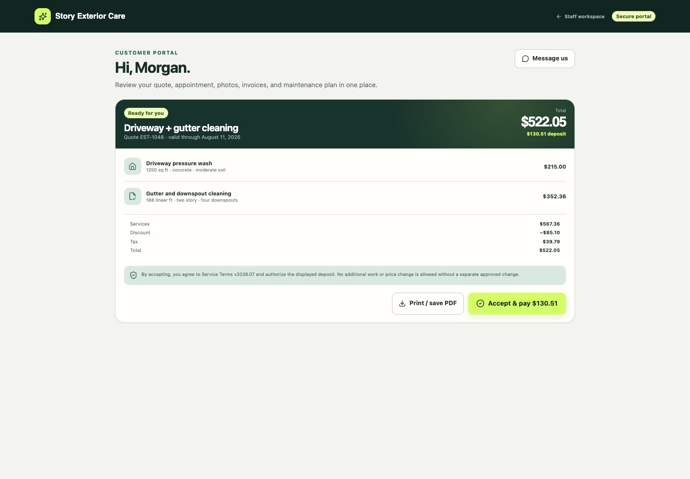
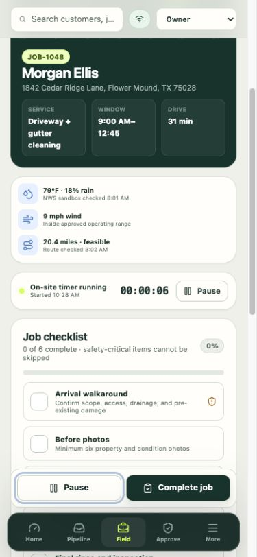

# StoryOps AI V1 build report

**Build date:** 2026-07-28  
**Branch:** `codex/storyops-v1`  
**Release posture:** **YELLOW — production-shaped V1 is locally verified; live customer use is not authorized**  
**Data used:** synthetic sandbox and local synthetic Supabase fixtures only  
**External actions:** no deployment, push, purchase, customer contact, provider enrollment, or secret activation

## Outcome

StoryOps AI V1 is implemented as one coherent, no-key operating slice for a
single-owner exterior-services company. It covers:

1. multi-channel lead intake and grounded qualification;
2. customer/property and photo-assisted scope records with explicit unknowns;
3. versioned Decimal pricing and deterministic policy evaluation;
4. exact-payload owner approval for exceptions;
5. quote publication, terms, deposit truth, and customer portal;
6. capacity, equipment, weather, and route-gated booking;
7. mobile field execution with offline replay, checklist, time, materials,
   before/after evidence, notes, incident handling, and signature;
8. invoice and provider-reconciled payment boundaries; and
9. consent-aware review/referral follow-up, provider delivery reconciliation,
   and recurring maintenance.

The implementation is more than a UI fixture. It includes a normalized
PostgreSQL model, RLS/RBAC, finite command RPCs, Edge workflows, provider
adapters, durable idempotency and approval contracts, backup/restore scripts,
PWA/offline behavior, tests, operating documents, and a hardened static
container.

The release remains YELLOW because no hosted environment, real provider
credential, external canary, production restore drill, or required professional
DFW launch review was supplied. The root StoryOps AI distribution license also
remains undecided.

## Architecture delivered

| Layer                | Delivered boundary                                                                                                                                                                                                     |
| -------------------- | ---------------------------------------------------------------------------------------------------------------------------------------------------------------------------------------------------------------------- |
| Product              | React 19/Vite 8 responsive PWA with setup, command center, pipeline, customers/properties, estimate/quote, dispatch, field, finance, AI office, approvals, operations, integrations, audit, and portal                 |
| Local sandbox        | Synthetic `DemoState` in IndexedDB, explicit sandbox provider receipts, and an idempotent offline outbox                                                                                                               |
| Deterministic domain | Base-10 Decimal pricing, versioned catalog/price-book rules, policy decisions, photo evidence, booking constraints, permissions, and financial/customer contracts                                                      |
| Live data plane      | Supabase Auth, normalized Postgres schema, private Storage, RLS, role-projected reads, finite optimistic-version commands, immutable audit records, and migration-controlled RPCs                                      |
| Server workflows     | Authoritative estimating; accepted quote/deposit/booking/field/invoice golden path; durable post-service outbound worker with no-resend ambiguity quarantine; webhook reconciliation; approved Stripe refund executor  |
| AI office            | Orchestrator plus intake, estimating, scheduling, follow-up, marketing, finance, safety, and owner-briefing specialists using structured output, allowlisted tools, injection defense, budgets, traces, and guardrails |
| Integrations         | Sandbox and opt-in live interfaces for OpenAI, Twilio SMS/voice, email, Stripe, Google Calendar, maps/geocoding, NWS, VROOM, optional server-signed Storage targets, and QuickBooks CSV                                |
| Runtime/operations   | Non-root static container, health/build metadata, security headers, optional pinned VROOM image, setup checks, backup/restore, runbooks, incidents, retention posture, CI, and release proof                           |

Authoritative design and operating rules are in
[docs/SOURCE_OF_TRUTH.md](docs/SOURCE_OF_TRUTH.md),
[docs/architecture/AI_OFFICE.md](docs/architecture/AI_OFFICE.md), and
[docs/architecture/INTEGRATIONS.md](docs/architecture/INTEGRATIONS.md).

## Safety and truth invariants

- Price, tax, deposit, duration, margin, and line-item values come from the
  published price-book calculation, never an LLM or JavaScript floating-point
  guess.
- The sandbox seed is recalculated from the same price-book engine used by the
  estimate workbench. Customer line items and totals have parity regression
  coverage.
- Draft and exception-priced estimates are not exposed in the customer portal.
  A quote appears only after policy/owner approval and portal publication.
  Publication is not proof of email or SMS delivery.
- A provider redirect, checkout session, accepted request, local queue, or
  webhook receipt alone never means paid or delivered. Reconciliation binds
  stable provider IDs to the expected company/customer/amount.
- Booking cannot bypass quote acceptance, deposit truth, current capacity,
  equipment, route, and weather evidence.
- Field completion requires the assigned active visit, all required checklist
  items, synced PNG before/after evidence, a durable PNG signature, stopped
  timers, notes, material usage, required SDS availability, and no unresolved
  incident.
- Technicians may report incidents but cannot close them. Owner closure is
  exact, versioned, idempotent, and audited.
- Post-service review/referral communication requires a completed job, paid
  invoice with provider proof, current consent, and deduplication. A queued
  or sandboxed record does not claim provider delivery. Live Twilio ambiguity
  remains `submitted_unknown`, is excluded from resend, and requires
  authoritative provider reconciliation. An exhausted reconciliation lease
  preserves the provider submission as `submitted`, exposes
  `reconciliation_required`, and never relabels the submission as failed or
  delivered.
- Price exceptions, large discounts, refunds, legal/safety messages, negative
  review replies, campaigns, vendor/bank actions, destructive changes, and work
  outside approved price books/SOPs require exact approval or remain human-only.
- External text, transcripts, OCR, reviews, and photo observations are
  untrusted data. They cannot expand authority, change prompts/policy, or invent
  measurements, availability, provider state, regulations, or chemical/safety
  instructions.

## Golden-path proof

The desktop and mobile Playwright projects each execute the lead-to-recurring
path. Separate browser cases prove exact discount approval, technician
isolation, booking/deposit gating, incident pausing, setup persistence,
service-catalog fail-closed behavior, and idempotent offline recovery.

The local Supabase release runner rebuilds all 12 migrations and then proves:

- database tenant isolation and immutable audit constraints;
- consent-scoped outbound authorization;
- Stripe/Twilio/email webhook reconciliation;
- provider/customer mapping and exact money checks;
- authoritative live estimate context, pricing, replay/conflict, approval, and
  quote publication;
- scoped lead-to-property linking;
- field completion and safety gates;
- accepted quote through invoice;
- paid-invoice review/referral and recurring-maintenance lifecycle; and
- owner-only approved refund execution.

## Screenshots

### Owner command center

### Deterministic estimate with exact owner approval

### Customer portal with reconciled line-item math

### Mobile field packet

These representative captures came from an earlier production-build pass at
desktop and iPhone-sized breakpoints. Visual QA found and corrected a stale
sandbox quote seed and a customer-facing gutter line-item display defect.
Regression tests now bind aggregate and line-item values to the same
deterministic calculation, and unpublished estimates remain private. A fresh
release recapture could not be made because the in-app browser backend was
unavailable; the final current UI was instead revalidated by all 18 desktop and
mobile Playwright cases. The captures are retained as representative product
evidence, not claimed as byte-current release screenshots.

## Final verification results

Verification was run on 2026-07-28 with Node `22.22.3`, the locked npm graph,
Docker, pinned Supabase CLI `2.110.0`, and the pinned VROOM service.

| Check                           | Result                                                                                                                                                                                                                                                                                              |
| ------------------------------- | --------------------------------------------------------------------------------------------------------------------------------------------------------------------------------------------------------------------------------------------------------------------------------------------------- |
| Clean locked install            | PASS — 598 packages installed, 599 installed dependency paths audited                                                                                                                                                                                                                               |
| `npm audit --audit-level=high`  | PASS — 0 vulnerabilities                                                                                                                                                                                                                                                                            |
| License inventory               | PASS — generated `NPM_THIRD_PARTY_NOTICES.txt` matches the lockfile/installed graph                                                                                                                                                                                                                 |
| Prettier                        | PASS                                                                                                                                                                                                                                                                                                |
| ESLint                          | PASS with zero warnings                                                                                                                                                                                                                                                                             |
| TypeScript project references   | PASS                                                                                                                                                                                                                                                                                                |
| Edge check                      | PASS — 30 files checked; 34 Deno contract tests passed                                                                                                                                                                                                                                              |
| Vitest                          | PASS — 26 files, 140 tests                                                                                                                                                                                                                                                                          |
| Infrastructure tests            | PASS — 24 tests                                                                                                                                                                                                                                                                                     |
| Production PWA build            | PASS — 1,958 modules; CSS 77.92 kB/14.67 kB gzip; main JS 868.41 kB/238.64 kB gzip; 6 precache entries totaling 930.44 KiB                                                                                                                                                                          |
| Playwright                      | PASS — 18/18 across Chromium desktop and iPhone 14 projects                                                                                                                                                                                                                                         |
| Local Supabase release contract | PASS — 12 migrations, seed, DB lint, SQL security/integration scripts, estimating/post-service Edge integrations, and actual field-media Edge canary                                                                                                                                                |
| Actual field-media canary       | PASS — assigned technician, valid PNG bytes, same-length tamper denial, direct-RPC/overwrite denial, exact Edge replay, durable path/hash, dependent completion, and customer orphan-write denial                                                                                                   |
| VROOM                           | PASS — 1 route, 0 unassigned, 1,200-second/16,000-meter deterministic custom-matrix result                                                                                                                                                                                                          |
| Executable local backup         | PASS — 3 checksummed DB files, all 12 migrations, 65 explicitly estimated table counts, 3 private buckets, and 3 actual PNG Storage objects                                                                                                                                                         |
| Restore dry-run                 | PASS — DB and Storage checksums plus explicit local target plan validated; the target was not contacted or mutated                                                                                                                                                                                  |
| Container                       | PASS — image `sha256:f8804e76a378364c2a94903f7bf7f28c50623eb753adb7291be9c0528c1684a6`, 57,534,037 bytes, non-root UID 1000, read-only root, all capabilities dropped, `no-new-privileges`, loopback-only host port, SPA fallback, notices, security headers, and healthy sandbox/revision metadata |
| Credential-pattern scan         | PASS — no high-confidence credentials in release candidates; no `.env` or `.env.local` present                                                                                                                                                                                                      |
| Core placeholder scan           | PASS — no product `TODO`, `FIXME`, unimplemented, or fake-success marker; only an integrity-hash false positive for the literal `XXX`                                                                                                                                                               |

The machine-readable final proof is
[artifacts/demo-proof-final.json](artifacts/demo-proof-final.json). It records
`status: passed`, full mode, E2E enabled, sandbox mode, and no provider
credentials used. Its verification window was
`2026-07-28T23:10:19.425Z`–`2026-07-28T23:11:45.133Z`.

The production build emits an intentional warning because the main client chunk
is above 800 kB. The build is successful; code splitting is a recorded
performance priority.

## Backup and recovery evidence

An actual local logical backup was created at the ignored, owner-local path
`backups/release-verify-20260728-final`. Its manifest:

- uses `storyops-supabase-logical-v1`;
- records all 12 applied migrations and requires `20260728110000`;
- fingerprints the migration set, schema, and each of 3 database files;
- reports 65 catalog estimates explicitly as non-transactional estimates;
- records migration fingerprint
  `7068f1ab2bb6d59c3df9ff4ac128c1620e3a16493228e7afe77eaa59e475ad31`
  and schema fingerprint
  `65a6c196a6ecb97a601463e8a46edc28e82c44062fb619ff7ab0ce9c6b8092fc`;
  and
- includes 3 private Storage buckets and 3 actual 68-byte `job-media` PNG
  objects with content hash
  `431ced6916a2a21a156e38701afe55bbd7f88969fbbfc56d7fe099d47f265460`.

The restore command validated that artifact in dry-run mode against the
explicit local target. No destructive restore was performed. The scripts and
local evidence are GREEN; hosted production encryption, off-site retention,
Storage export, and an isolated production-like restore drill remain YELLOW.

## Licensing and upstream provenance

- Atomic CRM foundation:
  `167a4cdb652b1ab2b4b030831cfa7adcf2099321`, MIT. Its notice is preserved in
  `LICENSE.atomic-crm.md` and `NOTICE.md`.
- StoryLand pattern audit:
  `32a67c4f6b3ad9b287b36b5e894c622b75c99976`. No top-level license was located,
  so only operating concepts were independently reimplemented; no code or text
  was copied.
- OCA/field-service checklist:
  `ac20c102ef86676899adfd0e4075141a7bf3028d`, AGPL-3.0-or-later convention.
  It was used only as a domain checklist; no code, schema, asset, or text was
  copied and StoryOps does not adopt AGPL.
- VROOM:
  `v1.15.0` / `43dd7d0b8b560431eb555bf335cf4797eb7343c4`,
  BSD-2-Clause; built without GLPK.
- vroom-express:
  `v0.12.0` / `5475901e60ec13ed9eec6cc87c811206a779eb03`,
  BSD-2-Clause.
- OpenAI Agents JS:
  `0.14.0` / `5f54ddc1e1389a6e419c93056b2d46aaae998da4`, MIT.

Exact direct/transitive package, container, action, and source-component
details are in [THIRD_PARTY.md](THIRD_PARTY.md) and
[NPM_THIRD_PARTY_NOTICES.txt](NPM_THIRD_PARTY_NOTICES.txt). The application
container embeds all four required notice files under
`/usr/share/licenses/storyops-ai/`.

StoryOps AI itself has no selected distribution license. That is a manual gate
before distribution.

## Credentials and manual activation

No credentials are required for the verified sandbox. No real key or customer
record was used.

For a reviewed live environment, operators must:

1. provision Supabase and apply the exact migrations without the local seed;
2. have a trusted administrator create an owner invitation whose protected
   `app_metadata.storyops_bootstrap_company_id` contains the exact intended
   company UUID, then let that owner invoke the guarded
   `complete_storyops_setup` boundary once;
3. verify the setup receipt and audit event, confirm all generated services
   remain inactive and the price book, terms, and retention policy remain
   draft/disabled, remove the bootstrap claim, and require a fresh owner
   session; setup completion does not authorize launch;
4. set the public browser inputs documented in `.env.example` without placing
   secrets in any `VITE_` variable;
5. store server/provider credentials in an approved secret manager;
6. activate one provider at a time only when both independent switches are
   reviewed: that provider's mode is exactly `live` and its matching enable
   flag is exactly `true`; either switch alone remains disabled;
7. validate callbacks/signatures, replay/duplicates, consent/opt-out,
   authoritative reconciliation, rate/spend budgets, timeout/retry, kill
   switch, and one low-risk owner-approved canary;
8. prove cross-role auth/RLS, private Storage, offline recovery, backup/restore,
   observability, alerting, TLS, and rollback in the hosted environment; and
9. complete the legal, tax, insurance, environmental, communications,
   privacy/retention, and safety gates in the DFW launch documents.

The setup, deployment-neutral runtime, integration, and recovery procedures are
documented in [README.md](README.md),
[docs/ADMIN_GUIDE.md](docs/ADMIN_GUIDE.md),
[docs/runbooks/INTEGRATION_RUNBOOK.md](docs/runbooks/INTEGRATION_RUNBOOK.md),
and [docs/compliance/BACKUP-RESTORE.md](docs/compliance/BACKUP-RESTORE.md).

## Known limits

- No hosted/live provider canary, production auth flow, or real customer data
  was exercised.
- Post-service live records truthfully queue review/referral communications.
  An accepted provider submission remains `submitted` until a signed provider
  receipt reconciles delivery. Retry exhaustion yields
  `reconciliation_required` for owner action; it never invents failure or
  delivery.
- Supported live offline field packets retain command identity/hash/version,
  original visit media/signature bytes and SHA-256 hashes in scoped IndexedDB.
  Replay uploads without overwrite, reads bytes back, and crosses an
  authenticated Edge boundary that independently checks image magic and hashes
  actual stored bytes
  before a service-only one-time attestation/finalizer registers metadata.
  Direct authenticated media registration, direct DML, and overwrite are
  denied; completion remains pending until every dependency reconciles. Hosted
  device-loss/quota/conflict canaries remain open.
- Supabase data mode makes that private field-media plane mandatory. The
  separately named `SIGNED_STORAGE_TARGETS_*` switches control only optional
  server-issued targets; their health card is not field readiness. Sandbox data
  mode makes zero Supabase Storage requests.
- Customer portal direct Storage upload is intentionally closed in V1. It
  needs a separate rate/quota/lifecycle finalizer and orphan cleanup before
  external users may write photo objects. Staff upload count/quota enforcement
  remains a hosted hardening item.
- The browser setup wizard configures the no-key sandbox profile. Live
  first-company setup is implemented only through a protected administrator
  invitation claim and the one-company guarded setup RPC; all generated
  services, price books, terms, retention, and optional providers start
  inactive, draft, or disabled and require reviewed activation.
- QuickBooks is a reviewed checksummed CSV export, not OAuth posting or bank/
  vendor mutation.
- VROOM custom matrices are proven. Coordinate routing requires a separately
  operated and reviewed OSRM/ORS/Valhalla endpoint.
- The static app has an 868.41 kB minified main chunk; route-level code splitting
  and PWA release-update/rollback testing remain performance/release priorities.
- Hosted production backup encryption, Storage export, off-site retention, and
  an isolated restore drill have not been performed.
- Production observability collectors, dashboards, paging, support/on-call,
  RPO/RTO, and customer-data migration are not configured.
- The owner briefing is a synthetic read-only product slice. A production
  scheduled briefing must link every claim to current durable records.
- Required Texas/DFW professional reviews are open. The cited launch/safety
  checklists are engineering aids, not legal, tax, environmental, insurance, or
  safety approval.
- The StoryOps AI root license is undecided.
- Nothing was deployed or pushed.

## Next priorities

1. Choose the root license and complete DFW legal/tax/insurance/environmental/
   safety/privacy/communications reviews.
2. Provision a reviewed hosted Supabase staging environment and run auth, RLS,
   Storage, offline, backup/restore, observability, and rollback canaries.
3. Activate provider adapters one at a time, starting with low-risk inbound and
   read-only boundaries, then prove reconciliation before outbound automation.
4. Add the reviewed owner reconciliation workflow for
   `submitted_unknown` Twilio sends and a signed unsubscribe/suppression path
   before enabling live post-service marketing email.
5. Perform an encrypted database + Storage restore drill and record measured
   RPO/RTO.
6. Split the main client bundle by route and add an explicit PWA update/rollback
   user flow.
7. Add production owner-briefing generation and source-linked operational
   alerting after the hosted data plane is proven.

## Release provenance

The verified implementation is commit
`7a3947160541bbe2c1bce6303480a447bc04a85a` on
`codex/storyops-v1`. This report-only provenance update follows that commit.
The branch is intentionally not pushed.
